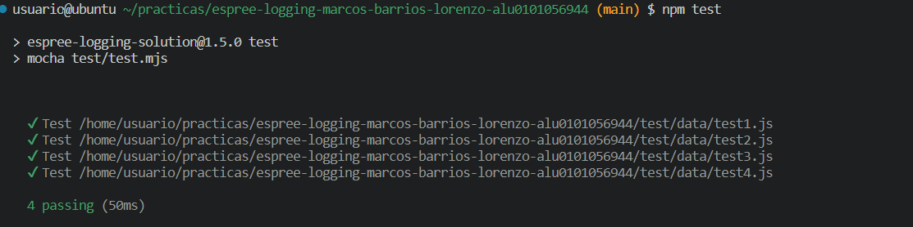
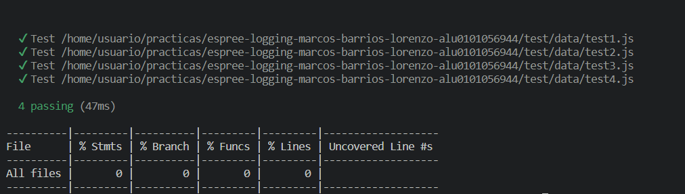

[](https://classroom.github.com/open-in-codespaces?assignment_repo_id=10326843)

# Práctica Espree logging

## API

<!-- Generated by documentation.js. Update this documentation by updating the source code. -->

#### Table of Contents

*   [transpile](#transpile)
    *   [Parameters](#parameters)
*   [addLogging](#addlogging)
    *   [Parameters](#parameters-1)
*   [addBeforeCode](#addbeforecode)
    *   [Parameters](#parameters-2)

### transpile

#### Parameters

*   `inputFile` **[string](https://developer.mozilla.org/docs/Web/JavaScript/Reference/Global_Objects/String)** path to input file
*   `outputFile` **[string](https://developer.mozilla.org/docs/Web/JavaScript/Reference/Global_Objects/String)** path to output file

### addLogging

#### Parameters

*   `code` **[string](https://developer.mozilla.org/docs/Web/JavaScript/Reference/Global_Objects/String)** to log

Returns **[string](https://developer.mozilla.org/docs/Web/JavaScript/Reference/Global_Objects/String)** logged code

### addBeforeCode

#### Parameters

*   `node` **[object](https://developer.mozilla.org/docs/Web/JavaScript/Reference/Global_Objects/Object)** of the AST

## Ejecutable

El ejecutable <code>bin/log.js</code> puede ser utilizado de la siguiente forma:

```bash
Arguments:
  filename                 file with the original code

Options:
  -V, --version            output the version number
  -o, --output <filename>  file in which to write the output
  -h, --help               display help for command
```

Ejemplo de ejecución:

```bash
npx funlog test/data/test1.js -o output.txt
```

## Instalación

Para instalar utilizar el siguiente comando:

```bash
npm i
```

## Resumen de lo aprendido

### Estructura de el arbol AST

Un nodo <code>FunctionDeclaration</code> tiene un una propiedad *body*, una propiedad *params* y una propiedad *args* y el *body* suele ser un <code>BlockStatement</code> cuyo *body* es un array. Dentro de ese array podemos meter otros nodos que queramos, capacidad que aplicamos para incluir un nodo <code>CallStatement</code> equivalente a <code>console.log(...)</code>

## Indicar los valores de los argumentos

Se ha modificado el código de `logging-espree.js` para que el log también indique los valores de los argumentos que se pasaron a la función.
Ejemplo:

```javascript
function foo(a, b) {
  var x = 'blah';
  var y = (function (z) {
    return z+3;
  })(2);
}
foo(1, 'wut', 3);
```

```javascript
function foo(a, b) {
    console.log(`Entering foo(${ a }, ${ b })`);
    var x = 'blah';
    var y = function (z) {
        console.log(`Entering <anonymous function>(${ z })`);
        return z + 3;
    }(2);
}
foo(1, 'wut', 3);
```

Para ello se modificó la función <code>addBeforeCode()</code> para que incluya un binding *params* en el string de salida del <code>console.log()</code>. Dicho binding es un array de elementos <code>String</code> construido a partir de la propiedad *params* del nodo <code>FunctionDeclaration</code>.

## CLI con [Commander.js](https://www.npmjs.com/package/commander)

Se importa <code>commander</code> y se obtiene el objeto <code>program</code> del mismo. Se invoca sobre ese objeto la configuración que queremos que tenga el ejecutable CLI. Luego invocamos su método <code>program.parse(process.argv)</code> para que procese la entrada de CLI y haga lo que lo hemos configurado para hacer.

*   <code>.option()</code> para poder utilizar la opción *-o*
*   <code>.argument()</code> para tener un argumento obligatorio.
*   <code>.version()</code> recibe la versión del *package.json*
*   <code>.action()</code> recibe un callback que tendrá tantos parámetros como argumento, salvo el último, que es un objeto options con los valores de cada opción.

## Reto 1: Soportar funciones flecha

Lo que hacemos es utilizar <code>estraverse.traverse(ast, {enter:(node, parents) => {...}})</code> para recorrer el árbol de sintaxis abstracto (AST) nodo por nodo. Si se detecta que el corresponde a una declaración de función se le agrega una nueva sentencia a la misma. Es ahí donde entra <code>addBeforeCode()</code> para agregar dicho nodo.

```js
    (...)
    estraverse.traverse(ast, {
        enter: function(node, parent) {
            if (/* si nodo declaración de función */) {
                addBeforeCode(node);
            }
        }
    });
    (...)
```

El problema está en que las funciones flecha son de tipo <code>ArrowFunctionDeclaration</code>, y ese nodo no está originalmente en la función, por lo que se le agrega.

## Reto 2: Añadir el número de línea

Espree permite obtener un objeto *loc* que contiene como propiedades *start* y *end*, los cuales tienen a su vez la propiedad *line* y *column*. Basta con utilizar *loc.start.line* en la función <code>addBeforeCode()</code>:

```js
(...)
var beforeCode = "console.log(`Entering " + name + `(${params})` +
      ` at line ${node.loc.start.line}\`);`;
(...)
```

Tras haber activado el objeto en la configuración de <code>espree.parse()</code>:

```js
const ast = espree.parse(code, {ecmaVersion: 6, loc: true /* activamos el objeto loc */});
```

## Tests and Covering

### Test results with mocha



### Code coverage using <code>nyc</code>


